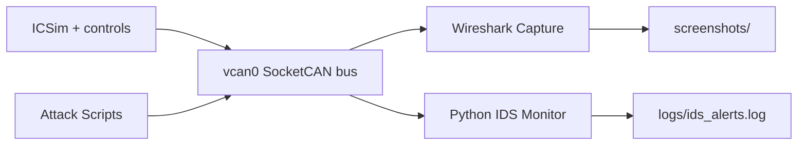

# CAN IDS Lab Architecture

## Components

1. **Vehicle Simulation Layer**
   - `vcan0` (SocketCAN virtual interface)
   - ICSim (`icsim`, `controls`) for vehicle telemetry simulation
2. **Attack Emulation Layer**
   - `attacks/spoof_attack.py`
   - `attacks/replay_attack.py`
   - `attacks/dos_attack.py`
3. **Monitoring & Analysis Layer**
   - Wireshark/CAN dissector for packet inspection
   - `scripts/capture_can.sh` for CLI traffic capture
4. **Detection Layer**
   - `src/can_ids/monitor.py` receives CAN messages
   - `src/can_ids/detector.py` evaluates detection rules
   - `src/can_ids/rules.py` applies unauthorized ID, frequency, and payload checks
5. **Evidence Layer**
   - `logs/` stores IDS alerts and captures
   - `screenshots/` stores visual evidence from Wireshark/ICSim

## Data Flow

